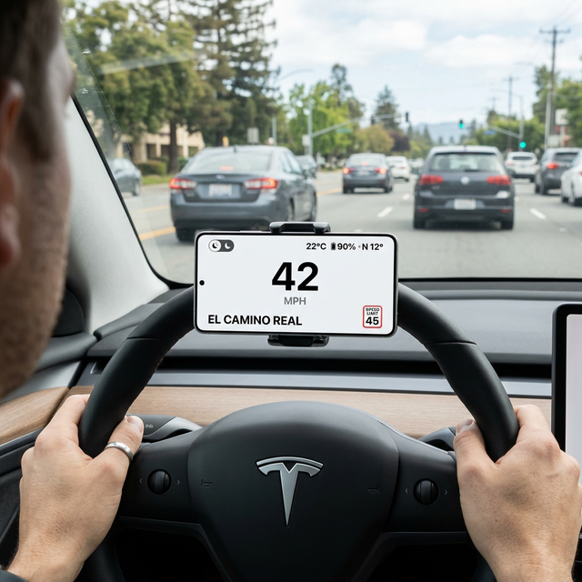

# Tesla Heads-up Display (HUD)

A modern, highly-responsive Heads-Up Display (HUD) Android application designed to provide crucial driving information at a glance. Built with Jetpack Compose, this app aims to supplement your driving experience with real-time speed, speed limits, battery status, and ambient temperature, wrapped in a sleek, Tesla-inspired UI.

---

## 📸 Previews

### Dark Mode (Night Driving)


### Light Mode (Day Driving)


---

## ✨ Features

- **Real-Time Speedometer:** Calculates exact vehicle speed using the Fused Location Provider.
- **Dynamic Speed Limits & Road Names:** Integrates with the Google Maps Roads API and Geocoding API to dynamically display the current road name and speed limit. Changes color and emits an auditory warning if you exceed the limit.
- **Smart Telemetry:** Displays phone battery percentage, charging state, compass heading, and device thermal temperature.
- **Auto Dark/Light Mode:** Uses the device's ambient light sensor to seamlessly switch between Day and Night modes depending on lighting conditions, reducing eye strain at night.
- **Bluetooth Auto-Launch:** Automatically detects and launches the app when your device connects to your car's Bluetooth (configurable, default: `"Chai's Tesla"`).
- **Offline Caching:** Utilizes a local SQLite database (Room) to cache recent road names and speed limits, reducing API calls and improving reaction times when driving on familiar routes.

---

## 🏗 Architecture

The application is built using modern Android development practices:

- **UI Framework:** **Jetpack Compose** for a declarative, reactive, and highly customizable user interface.
- **Local Storage:** **Room Database** is used for caching road data (`RoadDataDao`) and logging API requests (`ApiLogDao`).
- **Location & Sensors:** Uses `SensorManager` for ambient light detection and `FusedLocationProviderClient` for high-accuracy, low-latency GPS speed and bearing.
- **Networking:** **OkHttp** for making lightweight, fast REST requests to Google APIs.
- **Coroutines:** Kotlin Coroutines are used for all asynchronous background tasks, such as querying APIs and accessing the database.

### Core Components

- `MainActivity.kt`: The entry point. Handles permissions, sensor registration, location updates, and manages the immersive fullscreen window.
- `HudScreen.kt`: The Jetpack Compose UI layer. Handles all rendering, animations, and visual warnings.
- `SpeedLimitRepo.kt`: The repository responsible for fetching speed limits and road names from Google APIs, and falling back to the Room cache when appropriate.
- `RoomDb.kt`: The Room Database setup, Entities (`RoadData`, `ApiLog`), and DAOs.
- `BluetoothReceiver.kt`: A BroadcastReceiver that listens for Bluetooth ACL connection events to auto-launch the app.

---

## 🚀 Setup and Installation

### Prerequisites

1. **Android Studio** (Koala or newer recommended).
2. A physical Android device running Android 12 (API 31) or higher. (The app requires actual GPS and Bluetooth hardware to function optimally).
3. A **Google Maps API Key** with the following APIs enabled:
   - Roads API
   - Geocoding API
   - Maps SDK for Android

### Getting Started

1. Clone the repository:
   ```bash
   git clone https://github.com/yourusername/TeslaHeadsupDisplay.git
   ```
2. Open the project in Android Studio.
3. In the root directory of the project, create a file named `local.properties` (if it does not exist).
4. Add your Google Maps API key to `local.properties`:
   ```properties
   MAPS_API_KEY=YOUR_ACTUAL_API_KEY_HERE
   ```
   *This key is injected into the `AndroidManifest.xml` and `SpeedLimitRepo.kt` at compile time.*
5. **Generate your SHA-1 Fingerprint:**
   Run `./gradlew signingReport` in the terminal to get your SHA-1 fingerprint for your debug/release keystore.
6. **Update SpeedLimitRepo.kt:**
   Open `app/src/main/java/com/example/teslaheadsupdisplay/SpeedLimitRepo.kt` and replace the placeholder with your actual SHA-1 fingerprint to ensure API requests are authenticated by Google Cloud:
   ```kotlin
   private const val SHA1_FINGERPRINT = "YOUR_SHA1_FINGERPRINT_HERE"
   ```
7. Build and run the app on your physical device.

---

## 💡 Usage

Mount your Android phone horizontally on your dashboard or behind your steering wheel. The app requests location and Bluetooth permissions on first launch. 
Once granted, the app will automatically calculate your speed, lookup the speed limit of your current road, and adjust the brightness via the light sensor. 

To test the Dark/Light mode manually, use the sun/moon toggle switch located on the top left of the screen.

---

## 📜 License

This project is licensed under the MIT License - see the LICENSE file for details.
